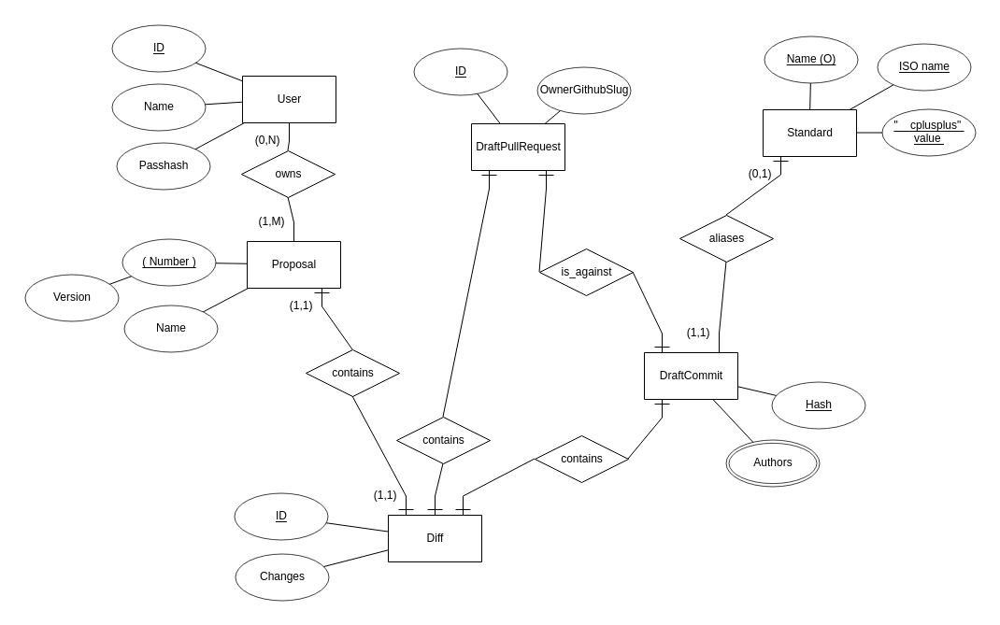
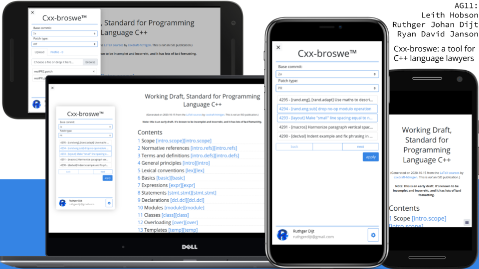

## Project Structure

| File        | Purpose           | What you do?  |
| ------------- | ------------- | ----- |
| `server/` | Backend server code | All your server code |
| [server/README.md](server/README.md) | Everything about the server | **READ ME** carefully! |
| `client/` | Frontend client code | All your client code |
| [client/README.md](client/README.md) | Everything about the client | **READ ME** carefully! |
| [docs/DEPLOYMENT.md](docs/DEPLOYMENT.md) | Free online production deployment | Deploy your app online in production mode |
| [docs/LOCAL_DEPLOYMENT.md](docs/LOCAL_DEPLOYMENT.md) | Local production deployment | Deploy your app local in production mode |

## Requirements

The version numbers in brackets indicate the tested versions but feel free to use more recent versions.
You can also use alternative tools if you know how to configure them (e.g., Firefox instead of Chrome).

* [Server Requirements](./server/README.md#Requirements)
* [Client Requirements](./client/README.md#Requirements)

## Getting started

```bash
# Clone repository
git clone git@git.ita.chalmers.se:courses/dit341/group-11-web.git

# Change into the directory
cd group-11-web

# Setup backend
cd server && npm install
npm run dev

# Setup frontend
cd client && npm install
npm run serve
```

> Check out the detailed instructions for [backend](./server/README.md) and [frontend](./client/README.md).

## System Definition (MS0)

### Purpose

Our system provides a tool for C++ language lawyers, extending the usability of [https://eel.is/c++draft/](https://eel.is/c++draft/) (statically generated by [Eelis/cxxdraft-htmlgen](https://github.com/Eelis/cxxdraft-htmlgen)), by adding a few features that are often needed by people digging into the standard or planning to publish proposals.

The defined features are:
- *Time-machine*: being able to look at the last draft before any published ISO C++ version, as well as any individual git commit of [the draft repository](https://github.com/cplusplus/draft)
- *Proposals*: a proposal author can provide their wording diff to the application, and then browse the draft with their diff applied to it (albeit highlighted in e.g. orange), as well as share a link to that altered draft preview; proposals should be revisable by their respective author(s), and users should be able to browse through public proposals. Users should be able to aggregate multiple proposals into the same draft preview, unless they have diff clashes.
- *PR Mirror*: any PR to [the draft repository](https://github.com/cplusplus/draft) should have its diff be trivially considered for input (eg., a special link with the PR number in it leads to the draft preview with the modifications applied)
- *Search*: `Ctrl+F`, but across the entire wording, possibly across multiple draft versions
- *WhenWasThatAdded*: get the git blame of any paragraph


### Pages

- **Preview**: the main page, displaying the currently selected preview (latest draft git HEAD by default); has foldable tools for all the above features
- **Proposals Repository**: a searchable list of all the publicly published proposals on the app
- **Proposal Differ**: the place where users can create, edit, delete or publish proposal diffs.

### Entity-Relationship (ER) Diagram



## Teaser (MS3)


